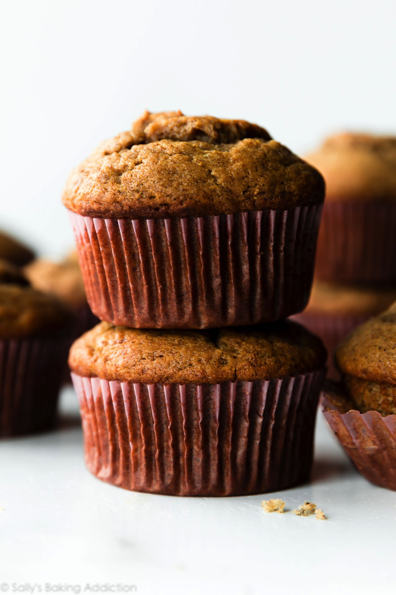

# Banana Bread Muffins
{ style="width:40%;" }

## Ingredients
* 3 large ripe bananas
* 3/4 cup sugar
* 1 egg
* 4 tbsp butter, melted
* 1 1/2 cup AP flour
* 1 tsp baking soda
* 1/2 tsp salt

## Steps
1. Preheat oven to 325. Line a muffin pan with liners or cooking spray (or lightly grease a 9 by 5-inch loaf pan) and set aside.
2. In a bowl, mash bananas, you should have 1 cup. Beat in sugar, then egg and butter.
3. In another bowl, stir together flour, baking soda; add to banana mixture and stir until all flour is moistened.
4. Pour batter into prepared pan.
5. Bake for 25 to 30 minutes (or 55-60 minutes if making a loaf).

