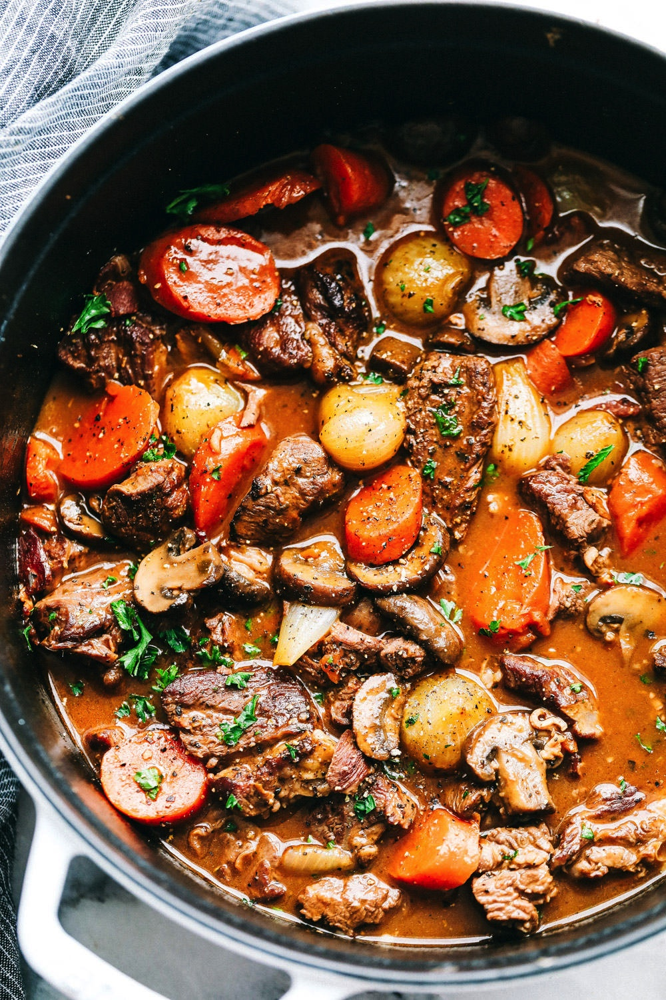

# Beef Bourguignon
{ style="width:40%;" }

## Ingredients
* 1 - 2 pkg stewed beef
* 1 bottle red wine
* 1 packet beef stew spice mix
* optional:
* potatoes
* onion
* carrots

## Steps
Throw all ingredients in crock pot and set to medium. Let go for 3-4 hours.

Add potatoes and carrots and let cook for another hour or two.

Can serve over rice or pasta

