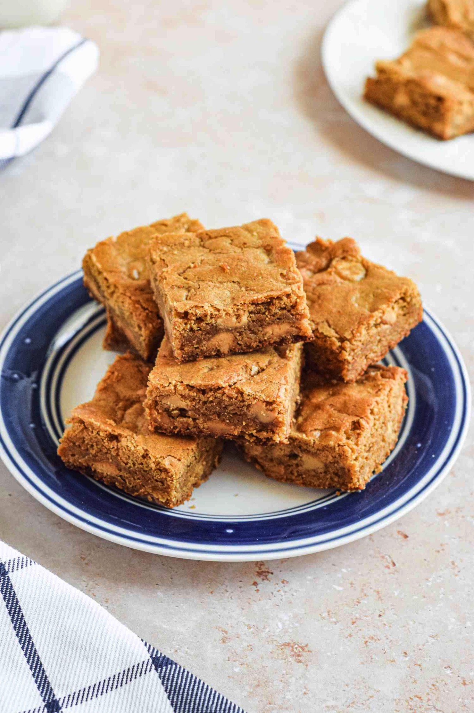

# Blondies
{ style="width:40%;" }

## Ingredients
*  7.5 oz unbleached all-purpose flour
* 1 teaspoon baking powder
* 1/2 teaspoon table salt
* 12 tablespoons unsalted butter ( 1 1/2 sticks), melted and cooled
* 10.5 oz light brown sugar
* 2 large eggs, lightly beaten
* 4 teaspoons vanilla extract
* 6 ounces white chocolate chips

## Steps
1. Heat oven to 350
2. Line a 13 by 9-inch baking pan with foil, leaving enough overhang to help you lift the blondies from the pan when they're done.
3. Whisk  7.5 oz flour, baking powder (1tsp), and salt (1/2tsp) together in medium bowl; set aside.
4. Whisk melted butter (12tbs) and brown sugar (10.5 oz) together in medium bowl until combined. Add the 2 large eggs and vanilla (4tsp) and mix well. 
5. Using rubber spatula, fold dry ingredients into egg mixture until just combined; do not overmix. Fold in chocolate and turn batter into prepared pan, smoothing top with rubber spatula.
6. Bake until top is shiny, cracked, and light golden brown, 22 to 25 minutes; do not overbake. Cool on wire rack to room temperature. Remove bars from pan by lifting foil overhang and transfer to cutting board. Cut into 2-inch squares and serve.

