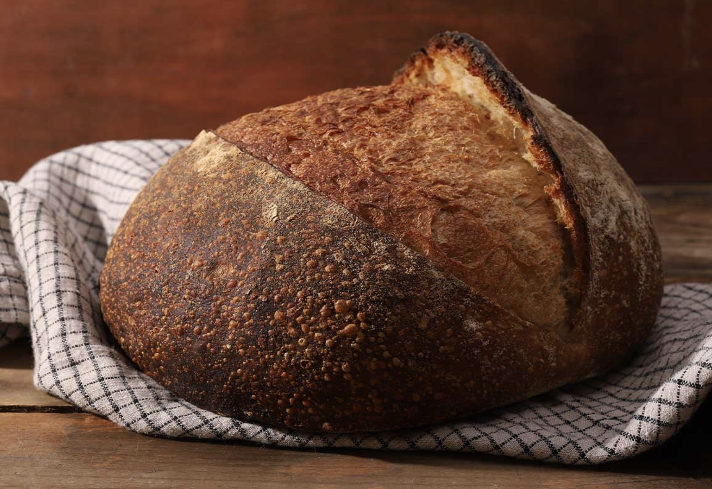

# Bread Boule
{ style="width:60%;" }

!!! warning ""
    Biga needs to be made the day before.  

## Ingredients

=== "White Boule"

    ### Biga
    * 272g 85°F water
    * 400g Bread Flour
    * 0.4g yeast

    ## Rest of Ingredients
    * 100g Bread Flour
    * 103g 105° water
    * 1.1g yeast
    * 11g salt 

=== "Whole Wheat Boule"

    ### Biga
    * 170g 85°F water
    * 0.3g yeast
    * 250g Bread Flour
    
    ### Rest of Ingredients
    * 250g whole wheat flour
    * 230g 105° water 
    * 11g salt
    * 1.6g instant yeast

## Steps
1. 12-14h before: Mix all ingredients for biga, cover with plastic wrap, and let sit at room temp.
2. In a medium bowl, mix together the biga and the warm water. Mix until the biga is broken up an softened. (Will make it easier to combine w the other ingredients)
3. Mix the instant yeast, and salt until a little frothy. Add rest of flour.
4. Mix using the pincer method. Use a wet hand to squeeze and massage the dough until there are no longer any big visual differences of biga (white flour) and rest of flour.
5. Cover the bowl and let the dough rise for 30 minutes.
6. Perform a strength building fold by pulling out a handful of the dough on one side and folding it over to the other side of the dough. Repeat this step again 30 mins later 2 more times. (3 folds total over 90 mins)
7. After the folds, grab the ball of dough, around its side/bottom, picking up the ball,  rounding and rotating it, then setting it back down to tension across the top and round it onto a ball. Do this several times.
8.  Cover and allow to rise at room temperature again for another 1h 45 minutes. 
9.  Flour your work surface and gently flip the dough out onto it.
10. Pop any large bubbles and shape the dough.
11. To shape the dough, grab a corner/side piece of the dough and pull it across to the other side of the dough, about 60% of the way across the other side of the dough. Grab another side/corner of the dough next to the first, and fold it across, about 60% of the way to the other side. Repeat all the way around the dough. You’ll do this between 6ish times in total, popping any big bubbles that form along the way. 
12. Flip the dough ball over so that the seam side is against the work surface. With your hands on either side of the dough, roll the dough on its seam side to seal it and create tension across the top of the dough.
13. Grab a medium sized bowl that’s just bigger than the dough you just made (i use the same medium stainless bowl that i mixed the dough in). Line the bowl with a thin kitchen towel and dust the towel with a mix of wheat and all purpose flour. Transfer the dough ball to the floured towel-bowl, seam side up, tucking the seam once again to better seal.
14. Fold the towel over the dough and let it proof at room temperature for 60 minutes (depending on the temperature of your house) until it has doubled in size. When you poke the dough, it should indent then slowly spring back.
15. Preheat the oven to 475°F with a dutch oven inside for 45 minutes. 
16. Carefully flip the shaped loaf into the dutch oven (seam side will now be DOWN) and score the top with a few cuts or slices.
17. Cover the dutch oven with the lid and bake for 20 minutes.
18. Remove the lid and continue baking for another 25 minutes.
19. Once baked, transfer the loaf to a wire rack to cool minimum 2 hours.