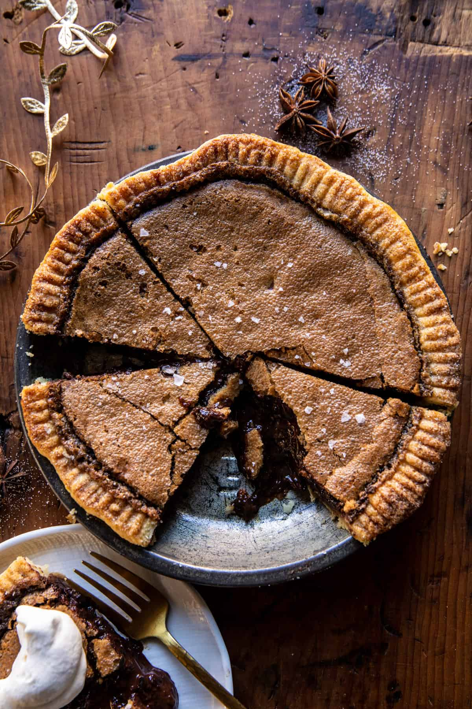

# Brown Sugar Maple Cookie Pie
{ style="width:60%;" }

!!! note ""
    Site [https://www.halfbakedharvest.com/brown-sugar-maple-cookie-pie/](https://www.halfbakedharvest.com/brown-sugar-maple-cookie-pie/)  
    Yield 8-10 Servings  
    1hr 20min  
    Can be made gluten-free with a [GF frozen crust](https://www.kroger.com/p/wholly-gluten-free-pie-shells-2-count/0007467784220)
    
## Ingredients
* 1 pie crust round
* 1 egg, beaten, for brushing
* vanilla sugar or coarse sugar, for sprinkling (optional)
* 4 tablespoons salted butter
* 1 cup light or dark brown sugar
* 2 large eggs
* 1 egg yolk
* 1/3 cup maple syrup
* 1/3 cup heavy cream
* 2 teaspoons vanilla extract
* 1 – 1 1/2 cups semi-sweet chocolate chips or chunks
* flaky sea salt

## Steps
1. Position a rack in the lower third of the oven. Preheat the oven to 350° F.
2. Fit the pie crust into an 8-inch pie plate. Brush the edges of the crust with beaten egg, then sprinkle with vanilla sugar (or coarse sugar). Lightly prick the bottom of the dough with a fork. Freeze 10 minutes.
3. Meanwhile, add the butter to a small saucepan set over medium heat, cook until the butter begins to brown, about 3-4 minutes. Remove from the heat and transfer to a heatproof bowl. Let cool.
4. Whisk together the brown sugar and 2 eggs, and 1 egg yolk until well combined. Add the maple syrup and cream. Whisk in the brown butter and vanilla until smooth. Fold in the chocolate chips. Pour the mixture into the crust.
5. Bake for 55-60 minutes, until the pie is puffed on top, but still wiggly in the center. The longer you bake, the more set your pie will be. Remove from the oven and let cool 20-30 minutes, then serve the pie warm, sprinkled with sea salt (if desired), and dolloped with whip cream. Or serve are room temp. Both options are great!
6. To make the whipped cream, whip the cream using an electric mixer until soft peaks form. Add the maple syrup and vanilla. Whip until combined and fluffy.
