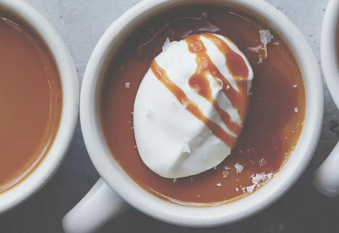

# Butterscotch Pots de Creme
{ style="width:60%;" }

!!! note ""
    Yield 8 Servings  
    1hr
    
## Ingredients

#### Custard
* 9 egg yolks, at room temperature
* 1¼ cups [250 g] packed dark brown sugar
* 4 Tbsp [55 g] unsalted butter
* 3½ cups [840 ml] heavy cream
* 1 tsp kosher salt
* ½ vanilla bean, split lengthwise

#### Salted caramel sauce  
* ¼ cup [50 g] granulated sugar  
* 2¼ tsp water  
* ¼ tsp kosher salt  
* ⅓ cup [75 ml] heavy cream  
 
#### Whipped creme fraiche  
* ¼ Cup [60 ml] whipping cream  
* 1 Tbsp Crème Fraîche  
* Flaky sea salt for sprinkling  

## Steps
1. Preheat the oven to 300°F [150°C]. Arrange eight ramekins or custard pots with a ¾-cup [180-ml] capacity in a large, shallow baking pan. Set a fine-mesh sieve over a large liquid measuring cup or pitcher. Place the egg yolks in a large bowl and set aside.
2. In a medium, heavy-bottomed saucepan over medium heat, cook the brown sugar and butter, without stir-ring, until the sugar turns a deep amber color and develops a nutty smell, 10 to 15 minutes. Pour the heavy cream into the mixture gradually (and carefully, to avoid hot spatters), whisking constantly. Remove from the heat. Add the kosher salt, and scrape the seeds from the vanilla bean into the mixture. Stir to combine.
3. Slowly pour the hot butterscotch mixture into the egg yolks, whisking constantly. Strain the custard through the sieve into the measuring cup. Pour into the ramekins, dividing the custard evenly. Pour hot water into the baking pan until it reaches halfway up the outside of the ramekins, and cover the pan with aluminum foil. Bake for 45 minutes. Rotate the pan and continue to bake for 15 minutes more, or just until the custard has set and doesn't jiggle with you shake the pan. Remove the pan from the oven, uncover, and, using tongs, carefully lift the custards from the water bath and set on a cooling rack. (The custards can be made up to 1 week in advance and stored, covered, in the refrigerator. Bring to room temperature before serving.)
4. To make the caramel sauce: In a small saucepan over medium-high heat, combine the granulated sugar, water, and kosher salt and cook, without stirring, until the mixture turns red-brown in color, about 5 minutes.
5. Gradually add the heavy cream, whisking constantly until the sauce is smooth. Set aside until ready to use.
6. To make the whipped crème fraîche: In a large bowl, whip the whipping cream with the crème fraîche until soft peaks form.
7. Serve the pots de crème at room temperature, topped with a dollop of the whipped crème fraiche, a drizzle of the salted caramel sauce, and a sprinkle of sea salt.
