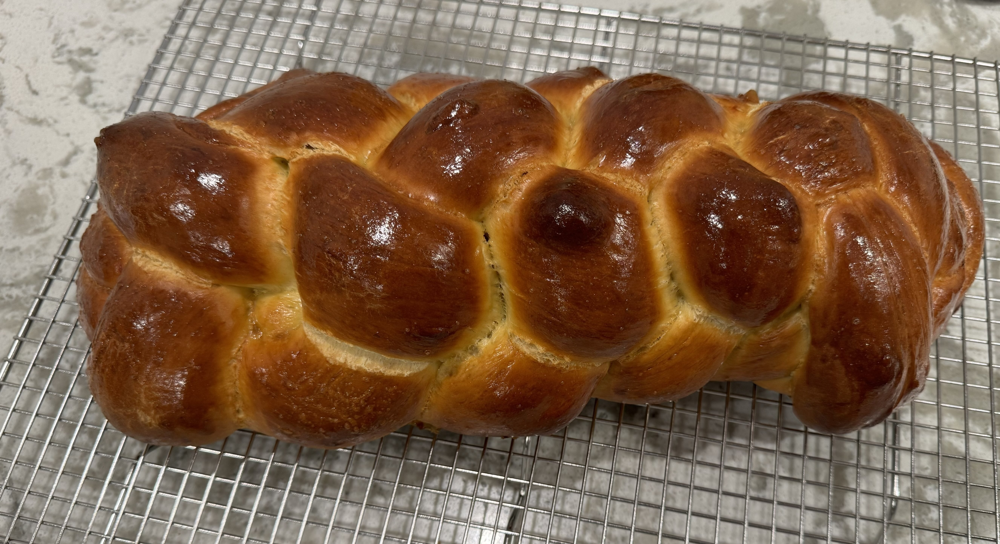

# Challah
{ style="width:80%;" }

!!! note ""
    Yield 1 Large Loaf    
    Time 1hr 20mins active, 4-6hr proof/rise
    
## Ingredients

### For the Preferment
* 4g active dry yeast
* 169 grams bread flour
* 160 grams water @ 105 degrees

### For the Dough
* 113g honey
* 75g extra-virgin olive oil
* 1 large egg yolk, at room temperature
* 2 large eggs, at room temperature, plus 1 beaten egg, for egg wash
* 405g bread flour, plus more for kneading the dough
* 11g kosher salt

## Steps
1. Make the preferment: In a medium bowl, combine the yeast and ¼ cup/57 grams warm tap water (100 to 110 degrees), and whisk until the yeast is dissolved. Add another ½ cup/113 grams room temperature water and the bread flour, and stir with a flexible spatula or bowl scraper until you have a smooth, pasty mixture with no dry spots. It should look like a thick batter.
2. Scrape the mixture into the center of the bowl and cover tightly. Let the preferment sit at room temperature until it’s nearly tripled in size, extremely bubbly across the surface, and jiggles on the verge of collapsing when the bowl is shaken, 1 to 2 hours (depending on the ambient temperature).
3. Mix the dough: In a medium bowl, whisk together the 113g honey, 75g olive oil, the yolk and 2 of the eggs until smooth, then add to the bowl with the preferment. Add the 405g bread flour and 11g salt. Use a flexible spatula or bowl scraper to stir the mixture, making sure to scrape the sides and bottom of the bowl to incorporate the preferment, until a shaggy dough comes together.
4.  Knead the dough: Generously flour the work surface, then scrape the dough and any floury bits out of the bowl and onto the surface (reserve the bowl). Generously flour the dough. Use the heel of your hands to knead the dough, adding flour as needed if the dough is sticking to your hands or the surface, until the dough is very smooth, elastic and slightly tacky, 10 to 15 minutes. (You can also combine everything in a stand mixer and mix on low speed with the dough hook for 8 to 10 minutes, adding more flour as needed until the dough pulls away from the sides of the bowl.)
5.  Test the dough: Pinch off a golf ball-size piece and flatten it with your fingertips. Stretch the dough outward in all directions gently and slowly: You should be able to form a sheet of dough that’s thin enough to allow light to pass through without tearing. If the dough tears, continue kneading. 
6.  Roll up the dough and gather it back into a ball, then knead until the raisins are distributed throughout.
7.  Let the dough rise: Gather the dough into a smooth ball, dust lightly with flour and place back in the reserved bowl. Cover and let the dough sit in a warm spot until it’s doubled in size, 1 to 2 hours (depending on the ambient temperature).
8.  Divide the dough: Punch down the dough inside the bowl to expel the gasses that built up during the first rise, then scrape the dough out onto a clean work surface. For a braided loaf, use a bench scraper or knife to divide the dough into 6 equal pieces. (You can eyeball it, or weigh the pieces for accuracy — each piece should weigh 180 to 190 grams.) For a round loaf, divide the dough in half.
9.  Braid or twist the dough: For a braid, roll each of the 6 pieces into snakes measuring about 18 inches long and slightly tapered at the ends. Dust the strands in flour to coat them lightly, then line them up so they’re side by side. Pinch together the ends of the strands to connect them at the top.

    !!! note "Braid Technique"
        1. Take the strand on the far right and cross it over the other strands, so it’s all the way on the far left side, placing it perpendicular to the other strands.  
        2. Take the strand that was originally on the far left, and is now second from the left, and bring it all the way to the far right, also placing it perpendicularly.  
        3. Fan out the remaining strands so there’s a generous space in the center.   
        4. Take the strand on the far left and bring it to the center, but group it with the strands on the right.  
        5. Bring the strand that’s second from the right and cross it over to the far left, also placing it perpendicular.  
        6. Then, fan out the strands again, leaving a space in the center, and bring the strand on the far right to the center, grouping it with the strands on the left.  
        7. Bring the strand second from the left and cross it over to the far right.  
        8. Repeat **C** - **G** until you’ve braided the entire length of the strands, tugging gently on the strands as you work to create tension in the braid.  

10. Pinch the ends of the braids and tuck them underneath the loaf, then transfer to a parchment-lined sheet pan. Make sure you have a couple of inches of clearance on either side of the braid so it can expand.

11. Alternatively, for a round, roll the two pieces of dough into long snakes measuring about 28 inches long, making sure to taper the snakes at one end. Dust the strands in flour to coat them lightly, then line them up so they’re side by side with the tapered ends aligned. Twist the two strands together, then start at the tapered end and roll up the twist into a tight coil, wrapping the fatter end around and tucking the end underneath the coil. Transfer the coil to a parchment-lined sheet pan.
12. Egg wash and proof the dough: Beat the remaining egg in a small bowl until it’s streak-free. Brush the loaf with the egg, then loosely cover the dough with some lightly oiled plastic wrap on a sheet pan, and let it rise at room temperature until it’s doubled in size, extremely puffy, and springs back but holds a slight indentation when poked gently with a wet finger, another 1½ to 2 hours (but possibly longer, depending on ambient temperature). The dough is easy to underproof, so, if you’re unsure, err on the side of overproofing. (The round loaf will also take longer to proof.) Alternatively, before proofing, you can refrigerate the dough overnight, but omit the egg wash and make sure it’s covered (plastic should cover it loosely but be sealed around the pan so the dough doesn't dry out).
13. Heat the oven: Arrange a rack in the center of the oven and heat it to 350 degrees.
14. Bake: Uncover the challah and brush with another layer of egg wash. Sprinkle the loaf with poppy or sesame seeds (if using) and bake until the loaf is shiny and burnished, an instant-read thermometer registers 190 degrees when inserted into the center, and it sounds hollow when tapped on the bottom, 35 to 40 minutes. Let the challah cool completely on the baking sheet.

