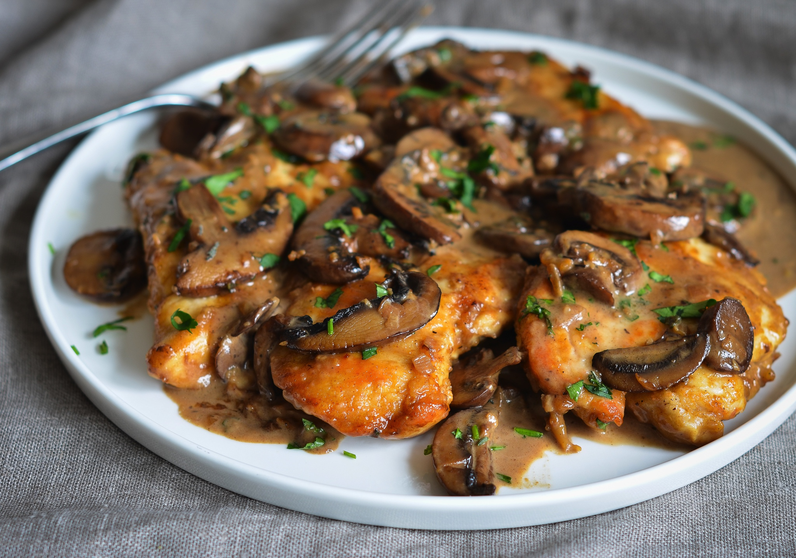

# Chicken Marsala

## Ingredients
* 1 package (or two if you want left overs) of thin chicken cutlets
* 2 pkgs of mushrooms- one baby Bella and one reg white button sliced
* 1 bottle of Marsala wine
* 1 box chicken stock
* Flour

## Steps
1. Dredge each piece of chicken in flour that is salted and peppered(not a lot just a bit of each) shake off any excess flour. 

2. On medium heat, pan sauté each piece in a combo of olive oil and butter/ margarine till just golden on each side. Set aside on a plate.

3. After all chicken pieces are sautéed, add more butter or margarine and sauté all the mushrooms stirring occasionally till they are caramelized. Then add a bit of salt and pepper.

4. Now add about 1/2 the bottle of Marsala wine and let simmer w the shrooms for a few mins. Then add about 1/2 c of the chicken stock and a tbls or  so of butter. Whisk all together. 

5. Taste to see if needs more wine and more salt and pepper. At this point, you can add some corn starch mixed w a little cold water if you like the sauce thick, but I don't. Pour juices from plate of chicken in the pan and add back the chicken pieces.

