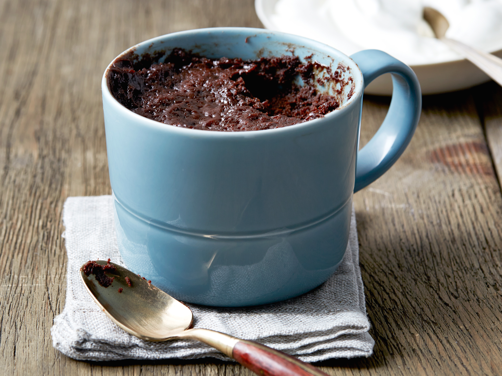

# Chocolate Mug Cake
{ style="width:60%;" }

!!! note ""
    Yield 1 Servings  
    90s  
    Site [https://www.foodnetwork.com/recipes/ree-drummond/chocolate-cake-in-a-mug-3158576](https://www.foodnetwork.com/recipes/ree-drummond/chocolate-cake-in-a-mug-3158576)  
    
## Ingredients
* 3 tablespoons all-purpose flour
* 3 tablespoons sugar 
* 2 tablespoons cocoa powder 
* 1/4 teaspoon baking powder 
* Pinch of salt, optional 
* 3 tablespoons milk 
* 3 tablespoons vegetable oil 
* Splash vanilla extract, optional 
* 3 tablespoons chocolate chips 

## Steps
1. Put the flour, sugar, cocoa powder, baking powder and salt if using in a 12-ounce microwave-safe ceramic mug. Blend thoroughly with a fork. Add the milk, vegetable oil and vanilla if using and blend until smooth. Stir in the chocolate chips.
2. Microwave on high for 90 seconds. Do not overcook or the cake will be dry. Let cool for 2 to 3 minutes before eating.
