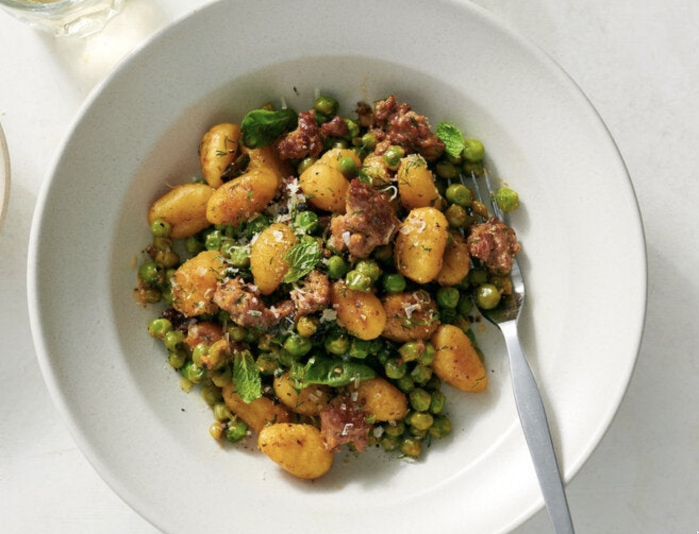

# Crisp Gnocchi With Sausage and Peas
{ style="width:70%;" }

!!! note ""
    Site: [https://cooking.nytimes.com/recipes/1024164-crisp-gnocchi-with-sausage-and-peas](https://cooking.nytimes.com/recipes/1024164-crisp-gnocchi-with-sausage-and-peas)  
    Yield 4 Servings  
    25 mins  
    
## Ingredients
* 3 tablespoons extra-virgin olive oil, plus more as needed
* 1 (12 to 18-ounce) package shelf-stable potato gnocchi
* 1 pound hot or sweet Italian sausage, casings removed
* 2 cups (10 ounces) frozen peas (no need to thaw)
* 1 tablespoon Dijon mustard
* ½ cup (1 ounce) grated Parmesan, plus more for serving
* Salt and pepper
* ½ cup torn basil leaves, plus more for serving

## Steps
1. In a large (12-inch) nonstick or well-seasoned cast-iron skillet, heat 1 tablespoon oil over medium-high. Break up any stuck-together gnocchi and add to the skillet in an even layer. Cover and cook, undisturbed, until the gnocchi are golden brown underneath and unstuck from skillet, 2 to 4 minutes. Cook, stirring, until crisp on both sides, 2 to 3 minutes. If the gnocchi are burning instead of browning or the skillet looks dry, add more oil. Transfer to a bowl or plate.
2. Add the remaining 2 tablespoons oil to the skillet, still over medium-high. Add the sausage and break into small pieces. Cook, undisturbed, until sausage is browned, 2 to 4 minutes. Stir and cook until the sausage is cooked through, another 2 to 4 minutes.
3. Stir in the peas, mustard and ½ cup water and scrape up the browned bits on the skillet. (It may not look like a lot of liquid, but the peas will release some as they cook.) Simmer until the peas are cooked through, 2 to 4 minutes.
4. Add the browned gnocchi and the Parmesan; stir until the cheese has melted. Season to taste with salt and pepper, then stir in the herbs. Serve topped with more herbs, Parmesan and black pepper as desired.
