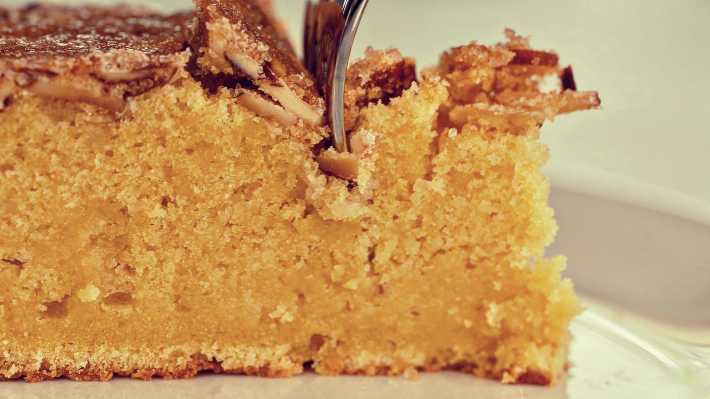

# Crunchy Almond Cake
{ style="width:70%;" }

## Ingredients
* 1 cup sliced unblanched almonds (4 oz / 113g)
* Melted butter for the pan
* 1⁄4 cup demerara sugar (1.8 oz / 50g)
* 3⁄4 cup plus 2 tablespoons all-purpose flour (4.1 oz / 118g)
* 1 teaspoon baking powder
* 3⁄4 teaspoon Diamond Crystal kosher salt or 1⁄2 teaspoon Morton kosher salt
* 7 ounces (200g) almond paste
* 1 1⁄2 sticks unsalted butter (6 oz / 170g), at room temperature
* 2⁄3 cup granulated sugar (4.7 oz / 133g)
* 4 large eggs (7 oz / 200g), at room temperature
* 1⁄4 cup amaretto (2 oz / 57g) 2 teaspoons vanilla extract

## Steps
1. Toast almonds 5-7 mins in a 350°F oven
2. Cut parchment into circle and put in pan. Brush butter on parchment and sides of pan
3. Sprinkle demerara sugar on bottom of pan and layer sugar and almonds
4. Mix dry ingredients together
5. Cream butter, almond paste, and sugar together with a hand mixer and work until pale and fluffy. Around 5 minutes
6. Add eggs one at a time while mixing on low speed until incorporated.
7. Add vanilla extract
8. Alternate amaretto and dry ingredients - mix at half speed
9. Thoroughly scrape and fold mixture to ensure everything is mixed
10. Dollop across pan in sections and smooth with offset spatula 
11. Bake 35-40 minutes
12. Check the cake for a springy to touch in center with light cracking
13. Take out of oven and let steam release and cool for 15 mins 
14. Cut around side and turn it out on a rack to finish cooling

