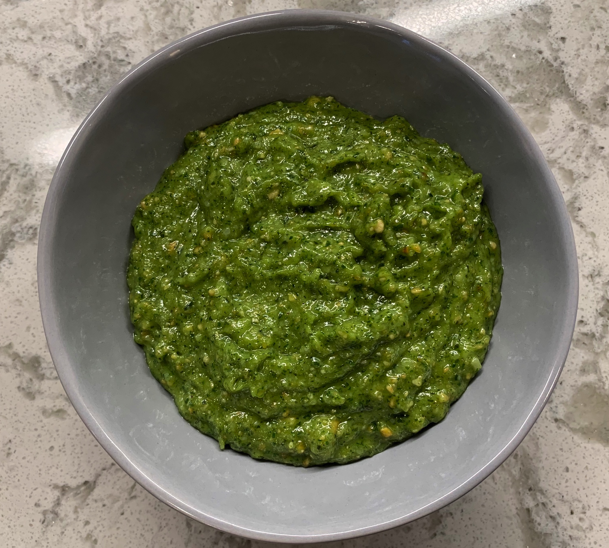

# Grandma's Pesto
{ style="width:70%;" }

## Ingredients
* 1 cup fresh basil
* 1 cup grated parmesan cheese
* 1 cup slivered almonds
* 3 or 4 cloves fresh garlic
* 1/2 cup balsamic vinegar 
* 1 cup olive oil

## Steps
1. In the food processor, process garlic, then add almonds until smooth(ish).

2. While still processing, add vinegar and oil slowly.

3. Add cheese slowly until smooth. Taste, and add salt and pepper.

Note: If it's not getting smooth enough, add more oil and/or balsamic.

