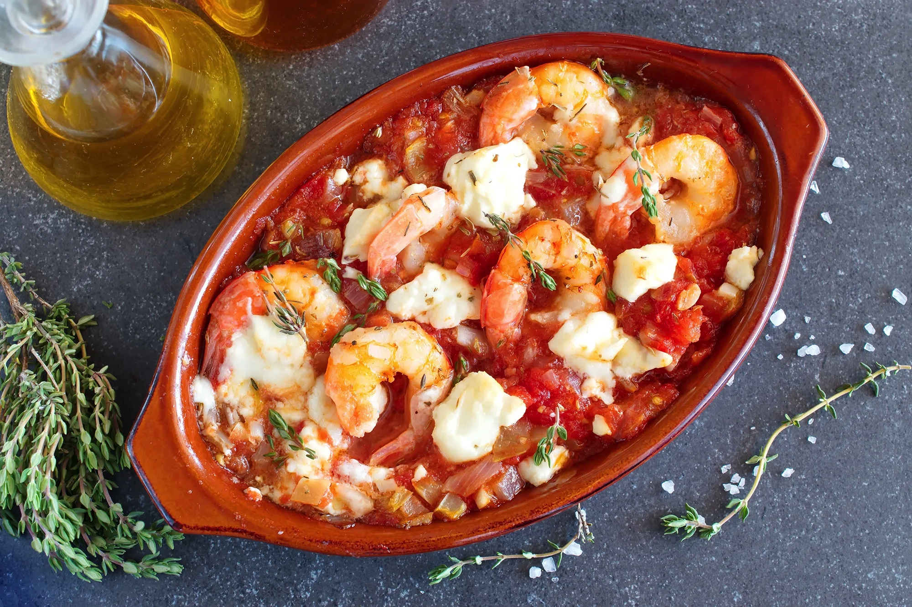

# Greek Shrimp

## Ingredients
* 1lb peeled and deveined shrimp
* 2 large cans crushed tomatoes
* 1/2 cup red wine
* 1tsp oregano
* 2tsp basil
* 1 pkg feta cheese (broken up)
* Spaghetti

## Steps
1. On medium-high heat, put tomatoes, red wine, oregano, and basil in pot

2. Taste sauce, add salt and pepper accordingly (or more herbs)

3. Boil pasta

4.. Add shrimp to sauce, let cook until shrimp turn pink. Add broken up feta and stir in.

5. Serve over pasta

