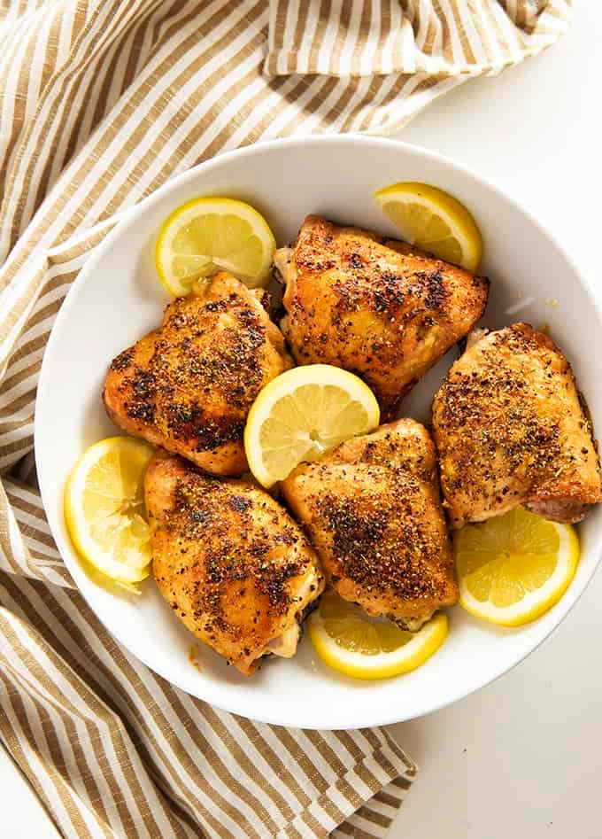

# Lemon Chicken
{ style="width:60%;" }

## Ingredients
* Rub:
* Zest of two lemons
* Two handfuls brown sugar
* Big palmful of dried italian seasoning
* Small Palm crushed Rosemary
* Season salt to taste
* Pepper 
* Sauce:
* Two heaping tablespoons of light mayo
* Juice of two lemons
* Heaping tablespoon country Dijon mustard
* Splash of maple syrup.

## Steps
0. Preheat oven to 325. 

1. Rub all over chicken. Under skin and both sides. If whole hen also inside the cavity. Let sit in fridge for an hour at least. 

2. Bring chicken back to room temp. 

3. Coat with sauce. Squeeze a bit more lemon juice over all and sprinkle with a bit more brown sugar. 

4. Bake slow on that low temp for 1hr 45 mins to 2 1/2 hours depending on oven. Baste during cooking. Can broil at the end to crisp skin.

