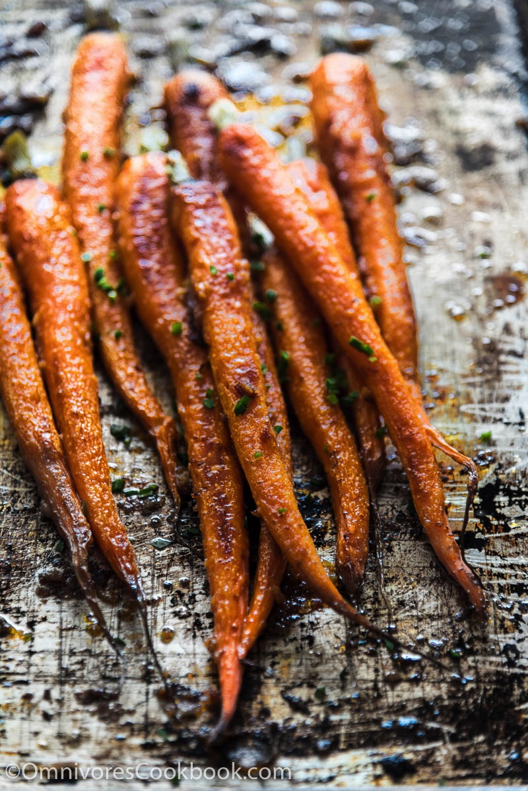

# Miso-glazed Carrots
{ style="width:60%;" }

## Ingredients
* 100g mild miso
* 30g balsamic vinegar 
* 65g honey
* 20g maple syrup
* 20g rice vinegar

## Steps
S&p and olive oil the cut carrots and put in 375 oven for 25m. 

