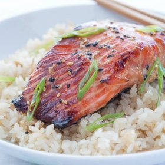

# Miso Salmon

## Ingredients
* 2 Tbsp. white miso
* 1 Tbsp. sake
* 1 Tbsp. rice wine vinegar
* 1 Tbsp. soy sauce
* ¼ tsp. sesame oil
* salmon

## Steps
1. Mix all the ingredients for the marinade in a large bowl.

2. Place the salmon in the bowl, skin side up. Spoon marinade and coat the salmon skin. Cover and keep in the refrigerator for 30 minutes to 1 hour. I don’t recommend longer than that as miso is quite salty.

3. Set the oven broiler to high and preheat for 3 minutes. Place the salmon fillets on the baking sheet lined with parchment paper. Remove excess marinade from the salmon as miso gets burnt easily while cooking. Broil salmon for 10-12 minutes, depending on the thickness, until salmon is cooked through.

