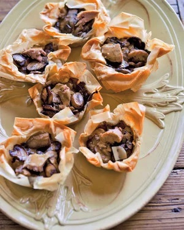

# Mushroom Strudels

## Ingredients
* 1/4 cup extra-virgin olive oil
* 2 tbls melted butter
* 1 large shallot, chopped finely
* 2 cloves garlic, chopped finely
* 1 1/2 pounds assorted fresh mushrooms (king trumpet, maitake, beech, shiitake, oyster, porcini), sliced
* Sea salt and black pepper
* 2 tablespoons each finely chopped thyme, tarragon, flat-leaf parsley and chives
* 1/2 cup baby spinach leaves
* 1/4 cup cream sherry
* 1/4 cup breadcrumbs
* 4 sheets phyllo 

## Steps
0. Preheat oven to 350.

1. Heat the olive oil in a pan. Add the shallots and mushrooms. Sauté till all the liquid is evaporated. 

2. Add the garlic, herbs, seasoning and spinach. When spinach is wilted add the sherry. Remove from the heat. 

3. On a cookie sheet lined with parchment paper and sprayed with cooking spray, place one sheet of phyllo. Brush with butter. Repeat with remaining sheets- one on top of the other.

4. Sprinkle with breadcrumbs. Add the mushroom mixture on one end of phyllo. Tuck in sides and roll toward other end keeping mushroom mixture in the middle. Place seam side down. 

5. Brush all over with melted butter. Bake at 350 for about 30 minutes. Let rest for 5 minutes then slice and serve. 

