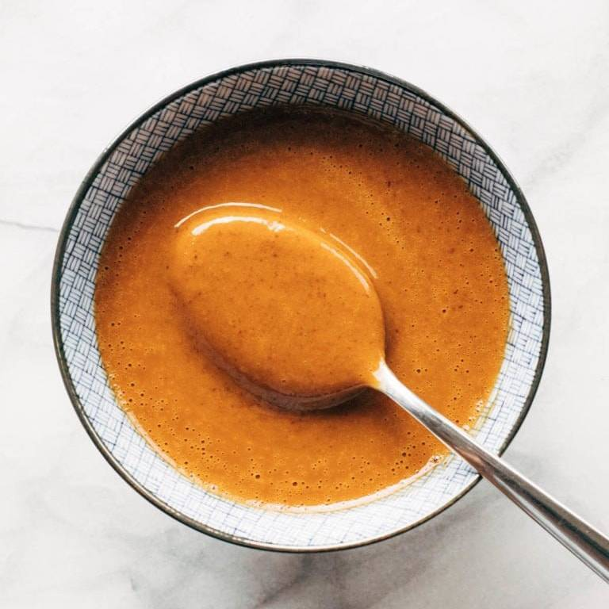

# Peanut Sauce
{ style="width:60%;" }

!!! note ""
    Yield 1 Servings  
    5min
    
## Ingredients
* 64g (4Tbsp) peanut butter 
* 40g Rice vinegar
* 25g Soy sauce 
* 20g Sesame oil
* 30g Water

## Steps
1. Mix Peanut butter and vinegar until peanut butter is softened.
2. Mix rest of ingredients together
