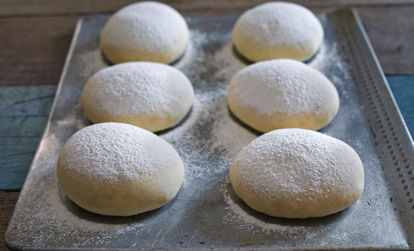

# Pizza Dough
{ style="width:80%;" }

## Ingredients
* 310g 00 Flour
* 310g AP flour
* 400g ~100°F Water
* 28g Diamond Crystal Kosher Salt  
{ style="width:20%;" }
* 18g olive oil
* 4g Fleischmann's Rapid Rise Instant yeast   
{ style="width:20%;" }

## Steps
1. Mix flour, water, oil in until no dry flour is left
2. Cover with kitchen towel and let rest for 30 minutes
3. Add salt and yeast and mix for 5 ish mins
4. Let proof for 2 hours. You will do 2 stretches. After 30 minutes, and then after another 30 minutes do 4 stretch and folds.
6. Split dough into 4 equal chunks. Each ball is roughly 240-260g
7. Ball up dough and place on well-floured baking sheet
8. Cover with another baking sheet, tape it up
9. Let rise in fridge for 24-48h

