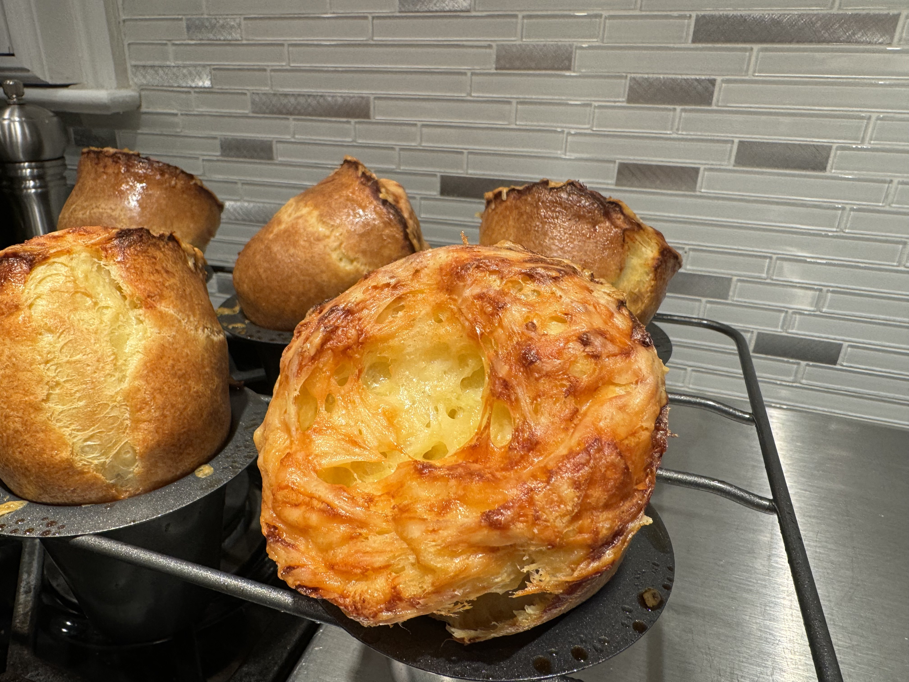

# Popovers
{ style="width:60%;" }

!!! note ""
    Yield 12 Servings  
    30mins active, 1h20m total
    Tip: Popovers can also be topped with caramelized onion, garlic and diced bacon instead of the cheese.
    
## Ingredients
* 4 cups all purpose flour
* 10 ounces grated Gruyere (2-1/4 cups)
* 8 large eggs
* 4 cups milk
* 1 tablespoon plus 2 teaspoons salt
* Non-stick vegetable oil spray

## Steps
1. Place popover pan in the oven and heat to 350° F.
2. Place flour and salt in a fine sieve and sift onto a wax paper.
3. In a small saucepan, heat milk until bubbles appear around edges. In a large bowl, whisk eggs until frothy.
4. Slowly whisk in hot milk. Set aside.
5. Whisk dry ingredients into egg mixture.
6. Stir until almost smooth.
7. Remove popover and spray with non-stick vegetable spray. Fill each cup with batter at least three-quarters full.
8. Top each popover with grated Gruyere.
9. Place a baking sheet on the rack below to catch any drips.
10. Bake 15 minutes.
11. Rotate the pan 180° so they rise evenly. Bake for 35 minutes more.
12. Invert the pan and remove popovers. Serve immediately.
