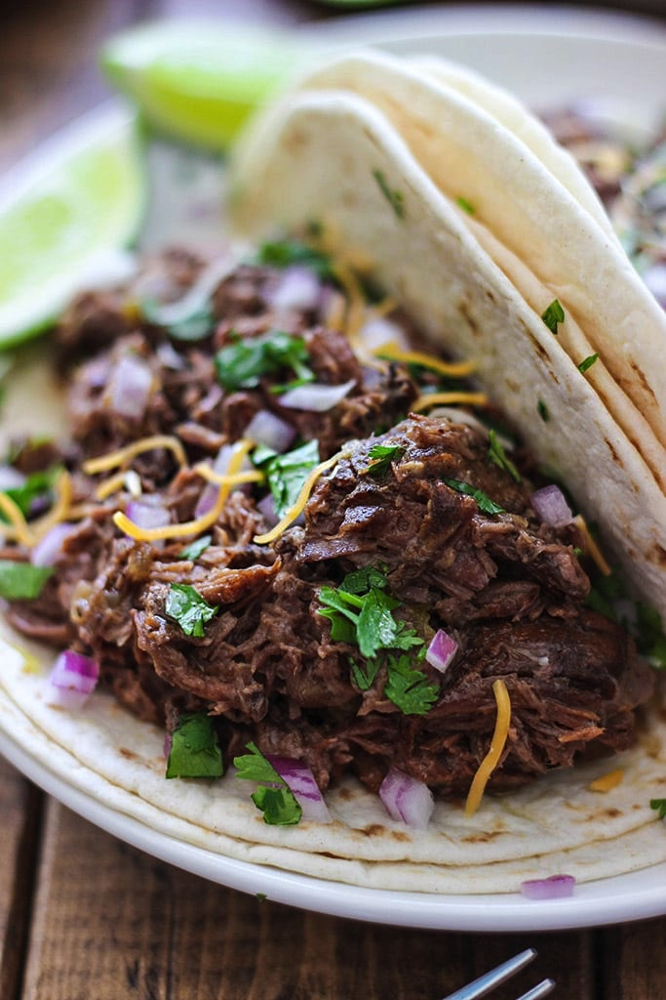

# Pulled Braised Brisket
{ style="width:60%;" }

## Ingredients
* 3lb Brisket
* 2 large onions
* Smoked Paprika
* Garlic Powder
* 6 cups stock (chicken, beef)
* Corn starch 

## Steps
Serve with tortillas and pickled onions

0. Preheat oven to 350
1. Set a dutch oven to high
2. Thinly slice onions
3. Well salt the entire brisket with kosher salt
4. When pot is hot, add 1-2tbs plain oil
5. Sear brisket on all sides (like 2-3mins a side)
6. Remove brisket, and add onions to pot
7. Add salt, 2-3tbs paprika, 2tbs garlic powder
8. Once you smell spices, add the 6 cups stock
9. Put brisket back in
10. If stock doesn't fully cover brisket, add a little more water
11. Bring to simmer
12. Put lid on, transfer to oven
13. Cook for roughly 1hr per pound of brisket
14. Use tongs to poke brisket. If SUPER tender, take out of oven
15. Remove brisket, and begin reducing liquid
16. Let brisket cool a bit, and shred
17. Add shredded beef back to pot
18. If not thick enough, add corn starch slurry

