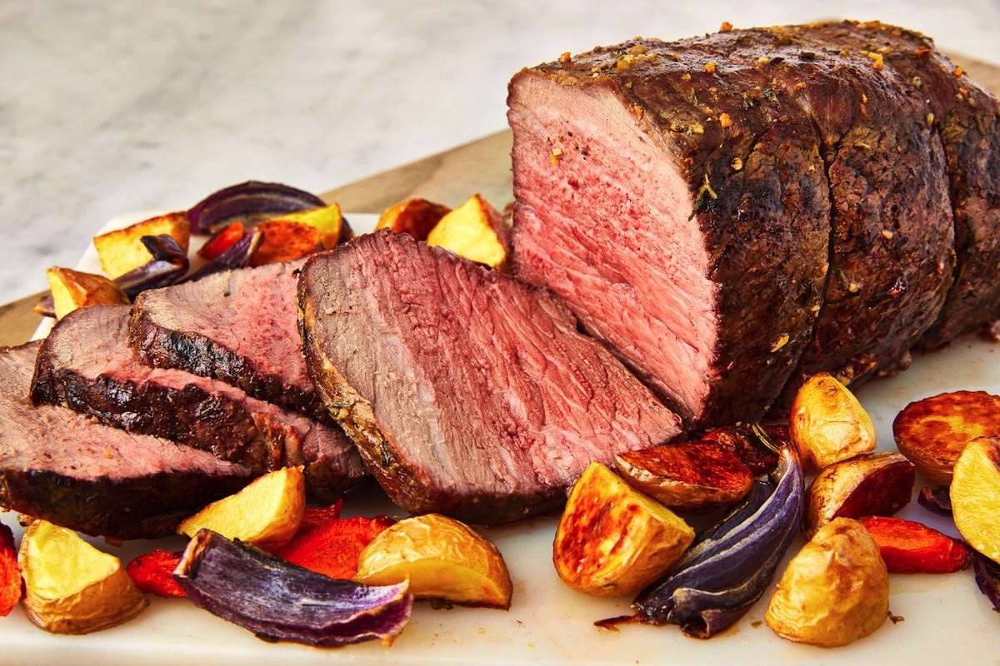

# Roast Beef & Potatoes
{ style="width:60%;" }

## Ingredients
* 1 large sweet onion
* 1 potato (per person)
* 3lb or bigger roast beef

## Steps
0. Preheat oven to 400 degrees F.

1. Pee and cut up 1 potato for each person (larger than bite size pieces)

2. Rough cut the onion.

3. Place roast in baking pan and put onion/potatoes around the edge

4. Add salt, pepper, garlic powder, and paprika over all. be liberal.

5. Place in over. Roast for about 20 minutes or until it starts to brown. Turn down to 350. Cook for an hour. Check internal temp. Medium rare is at about 130 degrees F.

