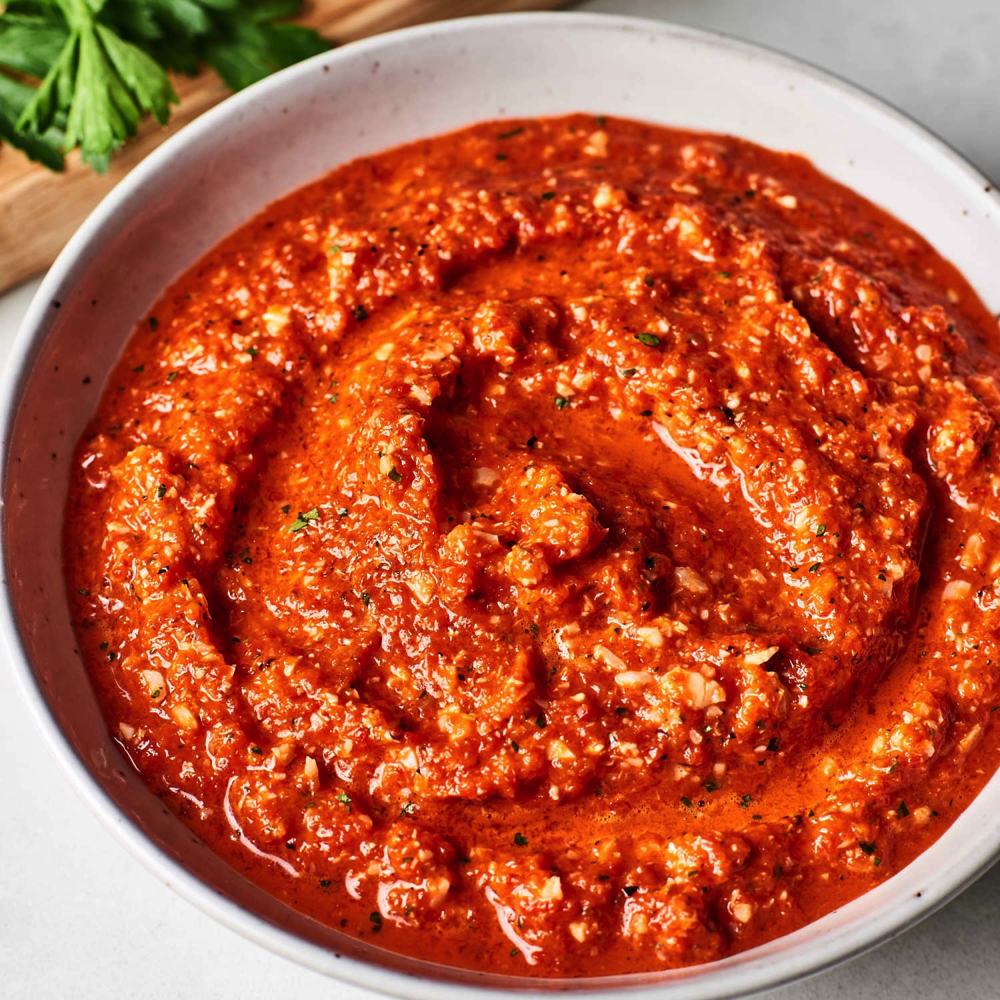
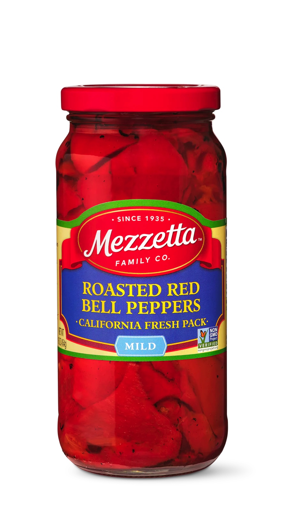

# Romesco Sauce
{ style="width:60%;" }

## Ingredients
* 16oz Roasted Red Pepper Jar  
{ style="width:20%;" }  
* 2 garlic cloves
* 3/4c toasted walnuts 
* 1/2c tomato puree
* 1c olive oil
* 4tbs red wine vinegar
* 2tsp smoked paprika
* 1tsp cayenne 

## Steps
1. Lightly toast walnuts in a dry pan
2. Blend all ingredients (we use the ninja bullet thing)

