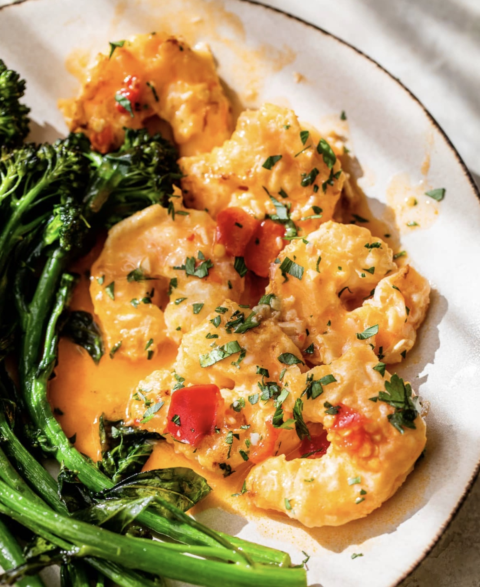

# Spicy Shrimp Francese
{ style="width:60%;" }

!!! note ""
    Site: [https://www.skinnytaste.com/shrimp-francese/](https://www.skinnytaste.com/shrimp-francese/)  
    Yield 4 Servings  
    30 mins  
    Cals: 256  
    Protein: 27.5  
    Carbs: 9  
    Fats: 11  
    
## Ingredients
* 1 pound peeled and deveined shrimp, about 32
* 3/4 teaspoon kosher salt
* 1/4 cup unbleached flour
* 2 large eggs, beaten with 1 tbsp water
* 2 teaspoons extra olive oil
* 2 cloves minced garlic
* 4 to 5 jarred Calabrian chili peppers, sliced (or more to taste)
* 1 tablespoon oil from the Calabrian chili peppers
* 1 1/2 lemons
* 1/4 cup white wine
* 1 1/2 cups low sodium chicken broth
* 2 teaspoons salted butter
* chopped parsley, for garnish

## Steps
1. Season the shrimp with 1/2 teaspoon salt and black pepper to taste, on both sides.
2. Place the flour in a shallow bowl, and the beaten eggs in another shallow bowl
3. Lightly flour half of the shrimp, shaking off excess, then dip into the beaten eggs
4. Heat a very large nonstick pan over medium heat. When hot cook the shrimp in two batches (in a single layer) – adding 1 teaspoon olive oil to lightly coat the bottom of the pan.
5. Cook the shrimp 2-3 minutes on each side, or until the shrimp is opaque and cooked through.
6. When cooked, transfer to a large plate and repeat with the remaining oil, flour and shrimp reserving the remaining flour.
7. Place the chicken broth in a mixing bowl with 1 tablespoon of the flour and whisk. Add the juice from 1 lemon.
8. To the skillet add 2 teaspoons of the Calabrian chili oil and add the garlic, cook 30 seconds, over medium heat until fragrant.
9. Add the Calabrian chili peppers and white wine.
10. Cook to reduce by half, then add the broth, bring to a boil and simmer over medium heat for about 4 to 4 minutes so it reduces slightly and thickens. Add the butter and let it melt.
11. Return the shrimp to the skillet and mix well, cook 30 to 60 seconds more to heat through.
12. Remove from heat and squeeze the remaining juice from the half lemon on top. Finish with parsley and enjoy!

