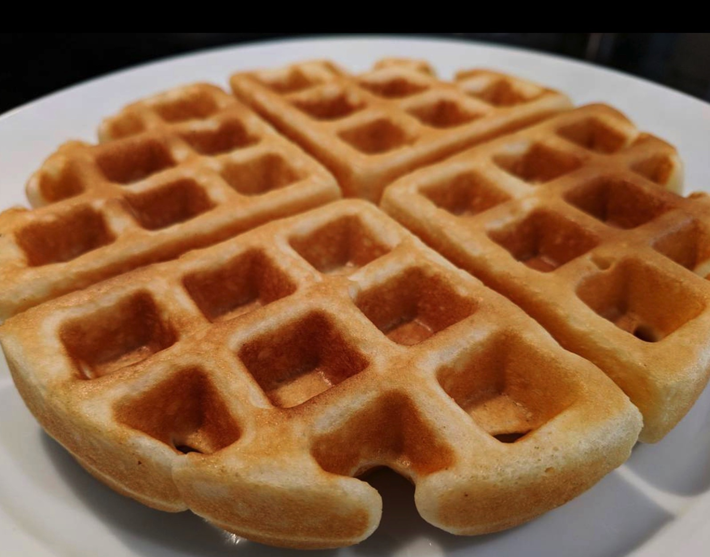

# Waffles
{ style="width:60%;" }

## Ingredients
* 1 cup AP flour + 1tbs
* 2tbs sugar
* 1tsp baking powder
* 1/4tsp salt
* 1 cup milk
* 2 large eggs
* 4tbs butter

## Steps
0. Preheat waffle iron

1. Melt butter in microwave (~1min)
2. Mix all ingredients
3. Let mixture sit 10-15 minutes
4. Cook per waffle iron instructions

